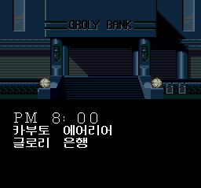
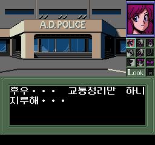

# 버블검 크래시! 한국어 패치

PC Engine HuCard 일본판용 비공식 한국어 패치입니다. v0.9.0은 엔딩까지 플레이 검수를 완료했습니다.

동명의 OVA를 바탕으로 한 어드벤처 게임입니다. 나이트 세이버즈의 네네를 중심으로 인물과 대화하고 현장을 조사하며 사건을 추적합니다. 이야기 진행 중에는 미니게임과 연구소 탐색·전투도 즐길 수 있습니다.

## 다운로드

[v0.9.0 패치 다운로드](https://github.com/kilk96/bubblegum-crash-korean-patch/releases/tag/v0.9.0)에서 `bubblegum-crash-ko-v0.9.0.zip`을 받아 압축을 풀어 주세요. 페이지의 **Assets**(첨부 파일)에서 찾을 수 있습니다.

현재 버전은 **v0.9.0 검수판**입니다. `Source code` 압축 파일은 받지 않으셔도 됩니다. 원본 게임 파일과 패치 적용이 끝난 게임 파일은 제공하지 않습니다.

## 적용 방법

1. 직접 보유하신 일본판 원본 ROM과 기존 세이브를 백업하고, 아래 **지원 원본과 파일 확인**의 크기·SHA-256을 확인해 주세요.
2. **xdelta 3.2 armor 호환 패처**에서 원본 ROM과 `bubblegum-crash-ko-v0.9.0.xdelta`를 선택해 주세요. armor는 원본과 결과 파일을 검사하는 형식이며, 구형 패처에서는 적용에 실패할 수 있습니다.
3. 결과를 원본과 다른 이름의 `.pce` 파일로 저장하고 아래 결과 SHA-256과 비교해 주세요. 기존 영문 패치나 한글판에 덧씌우지 말고 일본판 원본에 적용해 주세요.
4. 결과 파일을 PC Engine 에뮬레이터에서 실행해 주세요. 자세한 명령은 ZIP 안의 `README.md`에 있습니다.

## 한글판 화면





## 번역·확인 범위

- 대사와 번역된 선택 문구를 포함합니다. 인명 검색의 빈자리 표기도 교정했습니다.
- 엔딩까지 플레이 검수를 완료했으며, 플레이 중 일본어 출력은 발견되지 않았습니다.

## 실행과 저장

확인한 환경은 **Mesen 2.2.1**입니다.

- 다른 빌드에서 만든 세이브스테이트의 호환은 보장하지 않습니다. 기존 세이브는 백업해 주세요.
- 연구소 랜덤 전투를 줄이는 선택적 치트는 ZIP 안의 README에서 안내합니다. 기본 패치에는 활성화되어 있지 않습니다.

세이브스테이트는 실행 중인 상태 전체를 보관하는 에뮬레이터의 순간 저장 기능입니다.

## 알려진 제한

- 실제 기기와 다른 에뮬레이터에서의 동작은 확인하지 않았습니다.
- 원작 게임의 버그와 전투 난이도는 유지됩니다.

## 지원 원본과 파일 확인

| 항목 | 값 |
|---|---|
| 기종·판본 | PC Engine HuCard / 일본판 |
| 원본 형식 | 헤더 없는 `.pce` |
| 원본 크기 | 524,288바이트 |
| 원본 SHA-256 | `e96600058f35178c78a88eb9596678c973e0095ae8bd9cb060668065197f8895` |
| 결과 크기 | 786,432바이트 |
| 결과 SHA-256 | `6d9cab9bd302065bd7db25e0cb0fdc9394f690666ae5e48b68bda8cf360ca655` |

SHA-256은 파일 내용이 같은지 확인하는 값입니다. 파일명보다 크기와 이 값이 일치하는지 확인해 주세요. 524,800바이트인 헤더 포함 원본은 바로 적용할 수 없습니다.

Windows PowerShell에서 다음 명령의 파일명을 바꾸어 원본과 결과를 각각 확인하실 수 있습니다.

```powershell
Get-FileHash -Algorithm SHA256 -LiteralPath '확인할파일.pce'
```

## 문제 제보

[Issues에 제보해 주세요](https://github.com/kilk96/bubblegum-crash-korean-patch/issues). 패치 버전, 에뮬레이터 이름·버전, 발생 장소와 직전 조작, 문제 화면을 함께 적어 주시면 도움이 됩니다. 원본·패치 적용 완료 ROM은 첨부하지 말아 주세요.

## 공략 참고

- [o-g’s sandbox — バブルガム・クラッシュ！攻略](https://ogsb.kan-be.com/others/bubblegum.htm) (일본어): 주요 인물과 조작 방법, 어드벤처 진행 순서, 연구소 탐색 공략을 확인할 수 있습니다. 진행과 결말에 관한 스포일러가 포함되어 있습니다.

## 권리와 글꼴

게임과 원본 글꼴의 권리는 각 권리자에게 있습니다. 한글에는 Neo둥근모를, 일부 숫자·기호의 보조 글리프(글자 그림)에는 Galmuri11을 사용했습니다. 출처와 라이선스는 ZIP 안의 `FONT-NOTICE.txt`와 라이선스 문서를 확인해 주세요.
